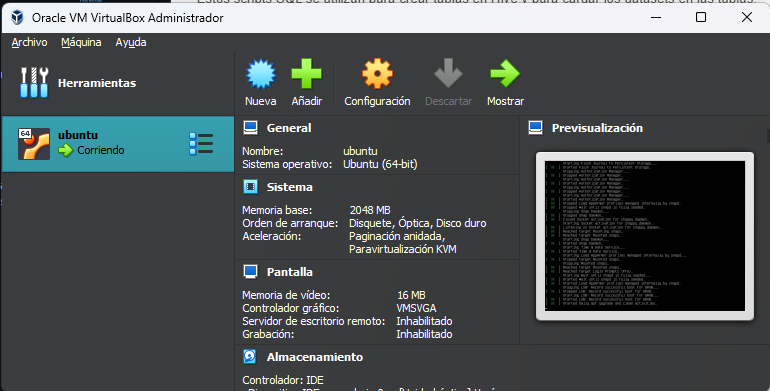
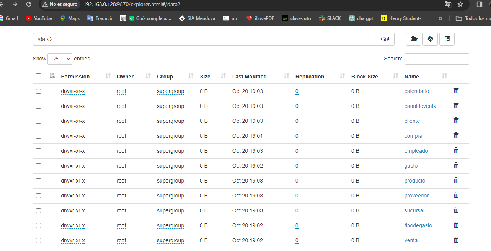
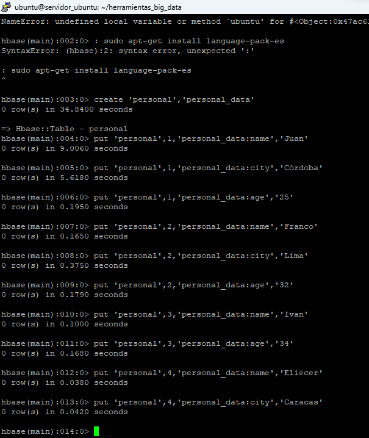
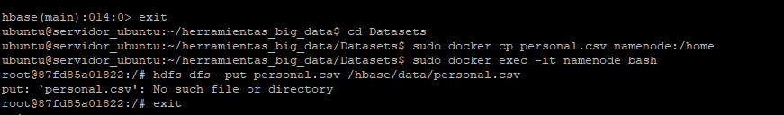
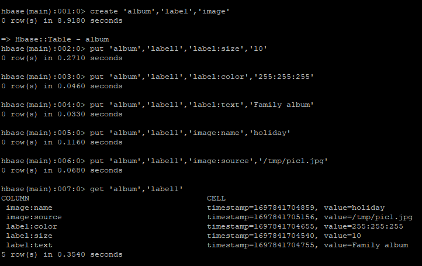

# Introducción

BIG DATA es un conjunto de datos tan grande y complejo que los sistemas tradicionales de procesamiento de datos no pueden gestionarlo. 

En el contexto de esta práctica integradora, un área de innovación de una empresa solicita construir un MVP (producto viable mínimo) de un ambiente de big data para cargar unos archivos CSV que anteriormente se utilizaban en un datawarehouse en MySQL.

Sin embargo, la gerencia de infraestructura no está muy convencida de utilizar esta tecnología, por lo que no se ha asignado presupuesto para esta iniciativa. Por lo tanto, el MVP se deberá implementar utilizando Docker, una plataforma que permite crear contenedores que empaquetan aplicaciones y sus dependencias en unidades autónomas que se pueden ejecutar en cualquier entorno.

Este trabajo tiene como objetivo presentar una guía para la implementación de un entorno de Big Data con Docker, que incluya los siguientes componentes:

Hadoop (HDFS)
Spark
Hive
HBase
MongoDB
Neo4J
Zeppelin
Kafka
Objetivos

Los objetivos de este trabajo son los siguientes:

- Definir los conceptos básicos de Big Data y Docker.
- Presentar una guía paso a paso para la implementación de un entorno de big data con Docker.
- Proporcionar un caso de estudio que ilustra el uso del entorno para cargar archivos CSV.
- Metodología

----

# Tareas Desarrolladas

# 1. <u> Iniciación</u>
Para comenzar, se inició una máquina virtual.
Se clonó el repositorio de GitHub que contiene las imágenes de Docker para los componentes de big data. 

<b>git clone https://github.com/lopezdar222/herramientas_big_data 
cd herramientas_big_data
</b>

Luego, se cambió al directorio de las imágenes y se ejecutaron los siguientes comandos para iniciar el entorno de Big Data:

<b>sudo docker-compose up -d</b>

Este comando inicia los contenedores Docker que contienen los componentes de Big Bata, incluidos Hadoop, Spark, Hive, HBase, MongoDB, Neo4J, Zeppelin y Kafka.

----------

# 2. <u> HDFS: Creación de los directorios para los datasets</u>

Una vez que el entorno de Big Data estaba en funcionamiento, se conectó al contenedor Docker que contiene el Namenode de Hadoop. Luego, se crearon los siguientes directorios en el sistema de archivos distribuido Hadoop (HDFS):

<b>canaldeventa</b>: Para almacenar los datos de ventas.
<b>calendario</b>: Para almacenar los datos de calendario.
<b>cliente</b>: Para almacenar los datos de clientes.
<b>compra</b>: Para almacenar los datos de compras.
<b>empleado</b>: Para almacenar los datos de empleados.
<b>gasto</b>: Para almacenar los datos de gastos.
<b>producto</b>: Para almacenar los datos de productos.
<b>proveedor</b>: Para almacenar los datos de proveedores.
<b>sucursal</b>: Para almacenar los datos de sucursales.
<b>tipodegasto</b>: Para almacenar los datos de tipos de gastos.
<b>venta</b>: Para almacenar los datos de ventas.
<b>data_nvo</b>: Para almacenar los datos de un nuevo dataset.
Carga de los datasets en el HDFS

Para cargar los datasets en el HDFS, se ejecutó el siguiente comando:

<b>
sudo docker exec -it namenode bash

cd home
mkdir Datasets
cd Datasets
mkdir canaldeventa
mkdir calendario
mkdir cliente
mkdir compra
mkdir empleado
mkdir gasto
mkdir producto
mkdir proveedor
mkdir sucursal
mkdir tipodegasto
mkdir venta
mkdir data_nvo
exit
sh Paso00.sh
sudo docker exec -it namenode bash
hdfs dfs -mkdir -p /data
hdfs dfs -put /home/Datasets/* /data

Este último comando copia todos los archivos que se encuentran en el directorio /home/Datasets en el directorio /data del HDFS.

Los datasets se encuentran almacenados en los siguientes directorios del HDFS:

------------------------------

#3. <u> Hive </u>

Hive es un lenguaje SQL de alto nivel que se utiliza para consultar y analizar datos almacenados en el HDFS.

Para utilizar Hive, se copiaron los siguientes scripts SQL al contenedor Docker que contiene el servidor de Hive:

<b>Paso02.hql
Paso03.hql
Paso04.hql</b>

Estos scripts SQL se utilizan para crear tablas en Hive y para cargar los datasets en las tablas.

<b>sudo docker cp Paso02.hql hive-server:/home 
sudo docker cp Paso03.hql hive-server:/home 
sudo docker cp Paso04.hql hive-server:/home 
sudo docker exec -it hive-server bash
cd /home
hive -f Paso02.hql
</b>
Para iniciar el servidor de Hive, se ejecutó el siguiente comando:

<b>sudo docker exec -it hive-server bash</b>

Una vez que el servidor de Hive estaba en funcionamiento, se cambió al directorio /home y se ejecutó el siguiente comando para ejecutar el script SQL Paso02.hql:

<b>hive -f Paso02.hql</b>

Este comando crea una tabla en Hive para almacenar los datos.

--- 

#4. <u> Formatos de Almacenamiento</u>
Formato Parquet + Snappy

Para almacenar las tablas creadas en el punto anterior en formato Parquet + Snappy, se deben realizar los siguientes pasos:

Crear directorios para almacenar los archivos Parquet:
<b>hdfs dfs -mkdir -p /data2/compra
hdfs dfs -mkdir -p /data2/gasto
hdfs dfs -mkdir -p /data2/tipodegasto
hdfs dfs -mkdir -p /data2/venta
hdfs dfs -mkdir -p /data2/canaldeventa
hdfs dfs -mkdir -p /data2/cliente
hdfs dfs -mkdir -p /data2/producto
hdfs dfs -mkdir -p /data2/empleado
hdfs dfs -mkdir -p /data2/sucursal
hdfs dfs -mkdir -p /data2/calendario
hdfs dfs -mkdir -p /data2/proveedor</b>

Convertir los archivos CSV a formato Parquet + Snappy:

<b>hive -f Paso03.hql</b>

Este script SQL crea copias de las tablas en formato Parquet + Snappy con las particiones aplicadas.

-----

#5. <u> SQL</u>

El siguiente paso es crear un índice en la columna IdSucursal de la tabla venta. Para ejecutar el script SQL, se utiliza el siguiente comando:

<b>hive -f Paso04.hql</b>

Una vez que se ejecuta el script SQL, el índice estará disponible para su uso.

- Mejorar el rendimiento de las consultas 
- Reducir la carga de trabajo del motor de procesamiento de Hive.
- Permitir que Hive utilice técnicas de optimización de consultas basadas en índices.

-----

#6. <u> NO SQL</u>

Para almacenar los datos en formato No-SQL, se utilizó HBase. HBase es una base de datos NoSQL que se utiliza para almacenar grandes cantidades de datos.

Para crear una tabla en HBase, se utilizó el siguiente comando:

<b>sudo docker exec -it hbase-master hbase shell 
create 'personal','personal_data'
put 'personal',1,'personal_data:name','Juan'
put 'personal',1,'personal_data:city','Córdoba'
put 'personal',1,'personal_data:age','25'
put 'personal',2,'personal_data:name','Franco'
put 'personal',2,'personal_data:city','Lima'
put 'personal',2,'personal_data:age','32'
put 'personal',3,'personal_data:name','Ivan'
put 'personal',3,'personal_data:age','34'
put 'personal',4,'personal_data:name','Eliecer'
put 'personal',4,'personal_data:city','Caracas'
exit

cd Datasets
sudo docker cp personal.csv namenode:/home
sudo docker exec -it namenode bash
hdfs dfs -put personal.csv /hbase/data/personal.csv
exit

sudo docker exec -it hbase-master bash
hbase org.apache.hadoop.hbase.mapreduce.ImportTsv -Dimporttsv.separator=',' -Dimporttsv.columns=HBASE_ROW_KEY,personal_data:name,personal_data:city,personal_data:age personal hdfs://namenode:9000/hbase/data/personal.csv
hbase shell
create 'album','label','image'
put 'album','label1','label:size','10'
put 'album','label1','label:color','255:255:255'
put 'album','label1','label:text','Family album'
put 'album','label1','image:name','holiday'
put 'album','label1','image:source','/tmp/pic1.jpg'
get 'album','label1'
exit</b>

El primer comando copia el archivo personal.csv al HDFS. El segundo comando importa los datos del archivo personal.csv en la tabla de HBase.

Para consultar datos en HBase, se utiliza el siguiente comando:

hbase shell
Una vez que se está en el shell de HBase, se pueden utilizar los siguientes comandos para consultar datos:

get: Para obtener los datos de una fila específica.
scan: Para obtener los datos de todas las filas de una tabla.
Por ejemplo, para obtener los datos de la fila label1 de la tabla album, se utilizaría el siguiente comando:

<b>get 'album','label1'</b>
Este comando devolvería la siguiente información:

ROW = label1
COLUMN = label:size,timestamp=1668636033550
COLUMN = label:color,timestamp=1668636033550
COLUMN = label:text,timestamp=1668636033550
COLUMN = image:name,timestamp=1668636033550
COLUMN = image:source,timestamp=1668636033550

HBase, beneficios:

- Es muy escalable que puede almacenar grandes cantidades de datos.
- Alto rendimiento para consultas de lectura y escritura.
- Es una BD distribuida que puede ejecutarse en múltiples nodos.
- Es de código abierto gratuita.

-----------------

#7. <u> MongoDB</u>

En los pasos 1,2 y 3: Copiamos los archivos iris.csv e iris.json al contenedor de MongoDB e importamos a las colecciones iris_csv e iris_json, respectivamente.

Paso 4: Conectamos a MongoDB y verificamos que las colecciones se importaron correctamente.

Paso 5: Exportamos los datos de las colecciones iris_csv e iris_json a archivos CSV y JSON, respectivamente.

Paso 6: Descargamos los JARs de MongoDB Hadoop Hive y MongoDB Hadoop Spark desde Maven y copiarmos al contenedor de Hive.

Paso 7: Copiamos el archivo iris.hql al contenedor de Hive.

Paso 8: Iniciamos el servidor de Hive y ejecutamos el archivo iris.hql.

El archivo iris.hql contiene un script para crear una tabla de Hive a partir de los datos del archivo CSV exportado en el paso 5.

Una vez que el script iris.hql se ejecuta correctamente, la tabla de Hive se crea y los datos de MongoDB se almacenan en la tabla.

------------------------

#8.<u> NEO4J</u>

<u>Búsqueda del camino más corto</u> en Neo4j, el <u>algoritmo de Dijkstra</u> es un algoritmo de búsqueda de caminos en grafos que encuentra el camino más corto entre un nodo fuente y un nodo destino.

El ejemplo primero crea un grafo con 6 nodos y 6 relaciones. Las relaciones tienen la propiedad cost que representa el costo de viajar de un nodo a otro.

A continuación, el ejemplo proyecta el grafo en un nuevo grafo llamado miGrafo. Este grafo solo contiene los nodos y las relaciones del grafo original, pero no los datos de las propiedades.

Luego, el ejemplo escribe una estimación del camino más corto entre el nodo A y el nodo E en el grafo miGrafo. Esta estimación se basa en el algoritmo de Dijkstra y se almacena en una nueva propiedad llamada PATH.

Finalmente, el ejemplo busca el camino más corto entre el nodo A y el nodo E en el grafo miGrafo. Utiliza la estimación del camino más corto para encontrar el camino más corto de forma más eficiente.

Los resultados de la búsqueda son los siguientes:

index | sourceNodeName | targetNodeName | totalCost | nodeNames | costs | path
------- | -------------- | -------------- | -------- | ---------- | ------ | ----
0      | A              | E              | 150      | [A, B, D, E] | [50, 50, 40, 10] | [A, B, D, E]

El camino más corto entre el nodo A y el nodo E tiene un costo de 150 y pasa por los nodos A, B, D y E.

<u>
logística</u> en Neo4j, utiliza el <u>algoritmo del árbol de expansión mínima (MST)</u>, encuentra el árbol de expansión mínima de un grafo, que es un árbol que conecta todos los nodos del grafo con el costo total mínimo.

En este ejemplo, el grafo representa una red de logística, donde los nodos son los almacenes y las relaciones son las rutas entre los almacenes. La propiedad cost de las relaciones representa el costo de transportar productos entre los almacenes.

El ejemplo primero escribe el árbol de expansión mínima del grafo en una nueva propiedad llamada <u>MINST</u>. Esta propiedad se almacena en los nodos del grafo y representa el camino más corto desde el nodo raíz del árbol (el almacén principal) a cada nodo del grafo.

Luego, el ejemplo consulta el árbol de expansión mínima para encontrar el camino más corto entre el almacén principal y cada uno de los otros almacenes. Los resultados de la consulta son los siguientes:

source | destination | cost
------- | -------------- | ----
A | B | 50
A | C | 40
A | D | 100

El camino más corto entre el almacén principal y el almacén B tiene un costo de 50, el camino más corto entre el almacén principal y el almacén C tiene un costo de 40 y el camino más corto entre el almacén principal y el almacén D tiene un costo de 100.

Este ejemplo se puede utilizar para optimizar las rutas de transporte de productos en una red de logística. Al utilizar el árbol de expansión mínima, se puede encontrar la ruta más corta entre el almacén principal y cada uno de los otros almacenes, lo que puede reducir el costo de transporte.

-----------------------------

#9.<u> ZEPPELIN</u>

<b>- Conexión a HDFS desde Zeppelin</b>
1) Probar WebHDFS en la máquina anfitrión para asegurarse de que está configurado correctamente.
2) Agregar una variable de entorno hdfs.url al interpreter de Zeppelin con el valor de la URL de WebHDFS del servidor anfitrión.
3) Ejecutar el código %file para abrir una sesión de shell en Zeppelin.
4) Ejecutar el comando ls para listar los directorios y archivos del directorio raíz de HDFS.

<b>- Conexión a Neo4J desde Zeppelin</b>

1) Agregar tres variables de entorno al interpreter de Zeppelin con los datos de conexión a Neo4J.
2) Ejecutar el código %neo4j para abrir una sesión de Neo4J en Zeppelin.
3) Ejecutar una consulta Cypher para crear un nuevo nodo en el grafo Neo4J.

----------------------

#10.<u> SPARK</u>
## 1)<u> y SCALA</u>

Los comandos que proporcionados se utilizan para iniciar PySpark o Scala en el <b>Spark master</b>, y para cargar el archivo raw-flight-data.csv desde HDFS. Este archivo contiene datos sobre vuelos, como el día del mes, el día de la semana, la aerolínea, el aeropuerto de origen, el aeropuerto de destino, el retraso de salida y el retraso de llegada.

## 2)<u> y KAFKA</u>

Spark con Kafka es una combinación poderosa para el procesamiento de datos en tiempo real. 

Spark es un motor de procesamiento de datos distribuido que puede escalar para procesar grandes volúmenes de datos. 

Kafka es un sistema de mensajería distribuido que puede entregar datos a Spark a alta velocidad.

Para usar Spark con Kafka, 
- a) debe crear un tema de Kafka. 
- b)crear un DataFrame de Spark que lea datos de Kafka. 
- c)procesar el DataFrame de Spark (filtrado, agregación y transformación)
- d)escribir los resultados en otro tema de Kafka o en otro almacenamiento de datos.

## 3)<u> Comparativa Dataset y Dataframe en Scala:</u>
Los DataSet y los DataFrame son dos estructuras de datos importantes que se utilizan en Spark. Los DataSet son más generales y pueden utilizarse para una variedad de tareas de procesamiento de datos, mientras que los DataFrame están optimizados para el procesamiento de datos analíticos. La elección de la estructura de datos adecuada depende de las necesidades específicas de la aplicación.

